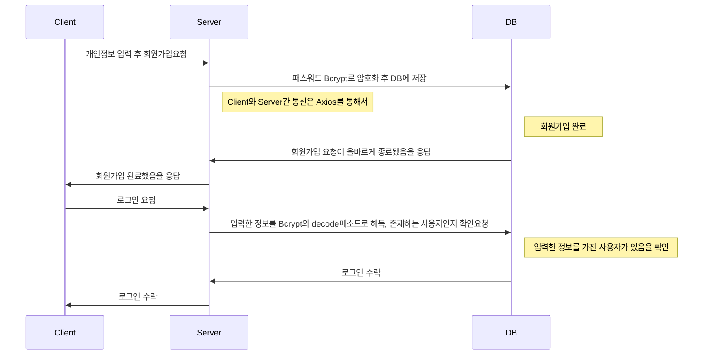
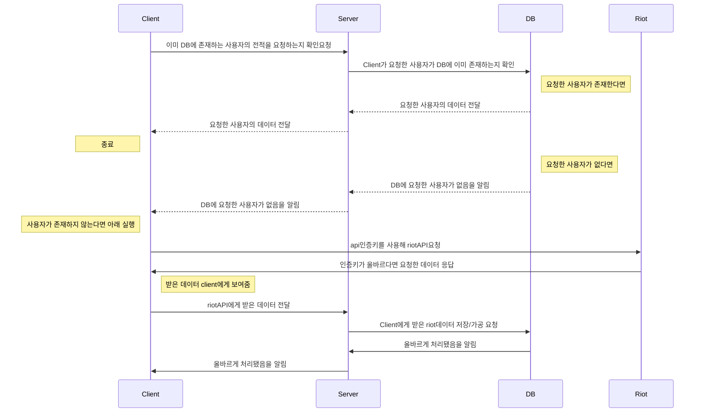

본 프로젝트는 [riot API](https://developer.riotgames.com/)를 활용한 [League Of Legends](https://www.leagueoflegends.com/) 게임의 전적 검색 웹 페이지 입니다.
**Node.js**와 **데이터베이스**를 활용한 첫 프로젝트 이기에, 전적 검색 외에도 **Node.js**와 **데이터베이스**를 상호 활용한 기능을 최대한 구현해보았습니다.

**League of Legends**는 전세계에서 가장 많은 사람들이 즐기는 게임이라고 해도 과언이 아닙니다.
때문에, 이 게임의 각종 통계치를 보여주는 전적 검색사이트들이 실제로 많이 서비스되고있습니다.
우리 주위에서 친숙한 소재이기도 하고 참고할 만한 사이트들도 많다는 것을 이유로들어, 첫 번째 프로젝트 주제로 삼게되었습니다.

페이지 URL : https://golden-chimera-76d804.netlify.app/

# :sunglasses: 주요 기능
**League Of Legends**<sup>[[1]](#footnote_1)</sup> 게임의 유저 전적 검색 사이트인 만큼 전적 검색 기능이 가장 주요한 기능입니다.
**Riot**<sup>[[2]](#footnote_2)</sup>에서 제공하는 API를 실시간으로 받아와 검색한 유저의 최근 게임 전적을 보여주고, 각 게임 전적의 간단한 정보를 제공합니다. 더 자세한 것은 아래에 기술합니다.

요즘 웹 페이지를 이용할 때, 사용자들 간 의견 공유를 위한 커뮤니티 기능이 빠질 수 없습니다. 
가장 먼저, 커뮤니티 공간에서 소통을 하기 위한 로그인, 회원가입 등의 기능을 구현했습니다.
사용자간 커뮤니티 기능을 하는 게시판 페이지도 구현하였습니다. 글을 작성하고, 댓글을 남기고, 좋아요를 누르는 등의 간단한 상호작용을 배치하였습니다.

기본적으로, **League of Legends**게임과 관련된 웹 페이지이기 때문에, Riot API에서 제공하는 
**League of Lengends**에서 등장하는 캐릭터들의 기본정보들을 모아놓은 '챔피언 정보' 페이지도 구현했습니다.

# :book: 기술스택
<br/>
<div align=center>  
<h3>언어, 플랫폼<h3/>


   
  
 
 
  
  <h3>도구<h3/>
  
  
 <br/>
 <br/>
 <br/>
</div>

# :computer:실행환경
프로젝트 제작과 실행은 2인이서 진행하였는데, 모두 윈도우 OS환경에서 실행했습니다.

Client 부분은 JavaScript의 라이브러리<sup>[[3]](#footnote_3)</sup>인 React환경에서 개발, 실행했습니다.
배포는 무료로 사용가능한 Netlify에서 진행했습니다.

Server 부분은 자바스크립트 RunTime인 Node.js와 그의 프레임워크인 Express로 개발, 실행했습니다.
배포는 AWS의 FreeTier 기간을 이용해 AWS로 배포했습니다.

데이터베이스는 No SQL 데이터베이스인 MongoDB를 사용했습니다.

# :factory:페이지 작동 방식

Arcane 페이지의 작동방식은 Client, Server, DB간의 상호작용으로 이루어져있습니다.
다음은 Client, Server, DB의 간단한 Request,Response 구조입니다.

### :key:로그인,회원가입 Process

### :mag_right:전적 검색 Process


# :books:라이브러리

Arcane페이지가 동작하는데 있어서 중요한 역할을 하는 라이브러리 몇가지가 있습니다.
다음은 중요하면서 자주사용된 라이브러리들 입니다.  

## Axios
Client와 Server의 비동기 통신을 위한 Promise 기반 라이브러리입니다.
```
await axios
  .get("/auth/login", {
      params: {
          username: inputUsername,
          password: inputPassword,
      },
  }) //
  .then((res) => {
      token.saveToken(res.data.token);
      window.location.replace("/");
  })
  .catch((err) => {
      console.log(err);
      if (err.response.status === 401) {
          alert("아이디(비밀번호)가 틀렸습니다");
      } else {
          alert("로그인에 실패했습니다.");
      }
  });
```
클라이언트에서 서버로 요청을 보낼 때 POST, GET, PUT, DELETE 이 4가지의 메소드를 가지고 CRUD를 할 수 있습니다. 서버에서도 마찬가지로 각각의 요청에 대해 응답을 해줍니다.

```
// 회원가입 & 로그인 & 유저관련 디비 설정
app.use("/auth", authRouter);

// 글 작성
app.use("/post", postRouter);

// 유저 전적 검색
app.use("/api/summoners", summonersRouter);

// 내 정보
app.use("/api/mypage", mypageRouter);

// 위의 라우터 모두 충족하지 않을경우
app.use((req, res, next) => {
    res.sendStatus(404);
});

// 에러 발생시
app.use((error, req, res, next) => {
    console.error("error: " + error);
    res.sendStatus(500);
});
```
```
const router = express.Router();

router.get("/", authController.me);

router.get("/info", authController.IsExistFromClient);

router.get("/login", authController.login);

router.get("/check", authController.checkMarking);

router.get("/exist", authController.IsExistFromClient);

router.post("/signup", authController.signup);

router.post("/marking", authController.bookMarking);

export default router;
```

Server에선 Routing을 통해 시각적으로 정돈되어보일 뿐 아니라, 개발과 유지보수에 불편함을 줄였습니다.

**Axios**는 Promise를 리턴하기 때문에, **Arcane** 웹 페이지에서 Client와 Server간 통신은 대부분 이렇게 비동기로 이루어집니다.
따라서, Client가 Server에 뭔가 요청한 후에 Server의 응답을 기다린 후 진행합니다.

## bcrypt, jwt
Client에서 회원가입을 요청했을 때, DB에 패스워드 원본으로 저장한다면 보안 문제가 있을것입니다. **bcrypt**는 Blowfish 암호를 기반으로 설계된 암호화 함수이며 현재까지 사용중인 가장 강력한 해시 메커니즘 중 하나입니다. 이를 통해, 패스워드를 원본 그대로 저장하지 않고 암호화한 상태로 저장합니다.

```
// 데이터베이스의 사용자 정보들과 조회 하여 일치하는거 찾기
    const user = await userRepository.findByUsername(username);

    // 존재하는 유저라면 해당 유저의 비밀번호가 맞는지 체크
    if (!user) {
        console.log("아이디가 존재하지 않습니다.");
        return res.status(401).json({ message: "Invalid user or password" });
    }

    // 유저 존재시 비번 체크
    // bcrypt의 compare을 사용하여 우리 데이터베이스에 저장된 hash버전의
    // password와 사용자가 입력한 password가 동일한지를 검사
    const isValidPassword = await bcrypt.compare(password, user.password);
    if (!isValidPassword) {
        //비번 틀릴시
        return res.status(401).json({ message: "Invalid user or password" });
    }

    // userRepository에서 받아온 사용자 고유 id로 토큰을 만듬
    const token = createJwtToken(user.id);
    res.status(201).json({ token, username });
```

**bcrypt**의 hash메소드를 이용해서, 입력받은 패스워드를 암호화합니다.
파라메터로 SaltingRounds라는 것을 보내주는 것을 볼 수 있습니다. Salting은 사용자가 보낸 비밀번호에 난수까지 추가하여 해시함수에 집어넣는 것입니다. Salt를 적용하여 나온 해시에다가, 다시 동일한 Salt을 적용하여 한번 더 해시를 도출하고, 이걸 계속 반복시키는 행위를  Salting Rounds라고 합니다. **Arcane**에서는 12로 값을 할당했습니다.

이렇게 암호화한 패스워드를 **jsonwebtoken**의 createJwtToken메소드를 이용해, **검증된** 토큰을 생성해서 Client에 돌려준다. 그리고, Client는 서버로부터 받은 **인증된 토큰**을 LocalStorage에 가지고있다가,**여기에 local storage 사진** 무언가 서버에 요청할 때, 이 **인증된 토큰**을 함께 Header 등에 넣음으로 로그인 된(Authenticated)사용자 임을 Server에 알린다.

## mongoDB, mongoose
**mongoDB**는 noSQL 데이터베이스입니다. noSQL은 'Non Relational Operation Database SQL'의 줄임말로써 기존의 관계지향형 데이터베이스가 아닌 데이터베이스들을 의미합니다. noSQL DB에 대한 경험이 없어, 다양한 경험을 쌓고자 **mongoDB**를 선택했는데, 장점과 단점이 명확했습니다. 
|                |NOSQL                          |SQL						   |
|----------------|-------------------------------|-----------------------------|
|스키마			 |`없음 `           				 |`있음`            		 	   |
|참조 무결성		 |`보장안함   `         			 |`보장`            			   |
|속도			 |`비교적 빠름`					 |`비교적 느림`				   |
|확장			 |`수평/수직적 확장에 용이`		 |`보통 수직적 확장`			   |

처음 noSQL로 서버와 데이터베이스 간 구조를 만들 땐, noSQL이 유연하고 간편해서 편리했습니다. 하지만, 생각보다 데이터간 참조가 많고 변경될 때도 많아서, 모든 Collection을 일일이 수정해야하는 일이 생겼습니다. 이에 프로젝트 진행시에 어떤 데이터베이스를 사용할지 쉽게 정해선 안 될것임을 생각했습니다.

**mongoDB**는 스키마가 없는 형태라고 했는데, Node.js에서 model이라는 mongoDB api로 스키마와 유사한 형태를 이룰 수 있습니다. 
```
e: String } }],
});

const userSchema = new Mongoose.Schema({
    username: { type: String, required: true },
    password: { type: String, require: true },
    email: { type: String, require: true },
    signupDate: { type: Date, default: Date.now }, // 회원가입 일시
    postlike: [postSchema],
    bookMark: [],
});

const matchHistorySchema = new Mongoose.Schema({
    matchId: { type: String, required: true },
    summonerName: { type: String, required: true },
    queueType: { type: String, required: true },
    result: { type: String, required: true },
    queueDate: { type: String, required: true },
    champion: { type: String, required: true },
    championLevel: { type: Number, required: true },
    spell1: { type: String, required: true },
    spell2: { type: String, required: true },
    mainRune: { type: String, required: true },
    subRune: { type: String, required: true },
    item0: { type: String },
    item1: { type: String },
    item2: { type: String },
    item3: { type: String },
    item4: { type: String },
    item5: { type: String },
    item6: { type: String },
    kills: { type: Number, reqired: true },
    deaths: { type: Number, reqired: true },
    assists: { type: Number, reqired: true },
    kda: { type: String },
    cs: { type: Number, reqired: true },
    time: { type: String, reqired: true },
    participants: [
        {
            summonerName: String,
            champion: String,
        },
    ],
});

const summonerSchema = new Mongoose.Schema({
    summonerName: { type: String, required: true },
    profileIconId: { type: Number, required: true },
    level: { type: Number, required: true },

    soloRankQueueType: { type: String, required: true },
    soloRankTier: { type: String, required: true },
    soloRankRank: { type: String },
    soloRankLP: { type: Number, required: true },
    soloRankWinNum: { type: Number, required: true },
    soloRankLoseNum: { type: Number, required: true },

    flexRankQueueType: { type: String, required: true },
    flexRankTier: { type: String, required: true },
    flexRankRank: { type: String },
    flexRankLP: { type: Number, required: true },
    flexRankWinNum: { type: Number, required: true },
    flexRankLoseNum: { type: Number, required: true },

    matchList: [matchHistorySchema],
});

export const User = Mongoose.model("User", userSchema);
export const Post = Mongoose.model("Post", postSchema);
export const Comment = Mongoose.model("Comment", commentSchema);
export const MatchHistory = Mongoose.model("MatchHistory", matchHistorySchema);
export const Summoner = Mongoose.model("Summoner", summonerSchema);
```
**mongoose**는 Server(Node.js)와 DB(mongoDB)를 연결시켜주는 ODM<sup>[[4]](#footnote_4)</sup>입니다.  **mongoose**덕분에 Node.js에서 **mongoDB**와 상호작용하기가 매우 편리했습니다. 
```
import { User } from "../model/schema.js";

// 사용자 아이디로 찾기
export async function findByUsername(username) {
    return User.findOne({ username });
}

export async function findById(id) {
    return User.findById(id);
}

export async function createUser(user) {
    return new User(user)//
        .save()
        .then((data) => data.id)
        .catch((err) => console.log(err));
}
```
**mongoose**의 메소드를 사용하는 것 만으로 데이터베이스에 접근해, 데이터를 가져오거나 추가하고 삭제하는 것이 가능했습니다.

## Riot API
Arcane 프로젝트를 시작하게 된 이유입니다. **Riot**사의 API를 사용하기 위해서는 API 인증키가 필요합니다. 해당 키는  [링크](https://developer.riotgames.com/)에서 로그인 후 발급받을 수 있습니다.  다음은 Riot API를 사용하는 예시입니다.
```
// riotAPI.js

// 특정 소환사의 pid, ppuid 등의 정보 가져오기
/**소환사명을 통해서 라이엇으로부터 해당 소환사 정보 불러오기 (id, puuid, account id, username, ....) */
async  getSummoner(username)  {
const  link  =  `https://kr.api.riotgames.com/lol/summoner/v4/summoners/by-name/${username}?api_key=${this.#Riot_API_Key}`;
const  json  =  await  getAPI(link);
return json;
}
```
해당API는 riotAPI.js 라는 파일에서 관리합니다. getSummoner함수에서 소환사명(**League of Legends**계정의 사용자명)을 받으면, RiotAPI를 호출하는 링크를 만듭니다. 링크에는 함수에서 파라메터로 받은 사용자명, 이전에 발급받은 API인증키 등이 사용됩니다. 
```
/**axios를 사용하여 해당 link의 api를 불러옴 */
async  function  getAPI(link)  {
	let data;
	await axios
		.get(link)
		.then((res)  => (data = res.data))
		.catch((err)  =>  {
		throw err;
	});
	return data;
}
```
getAPI함수는 파라메터로 넘겨준 링크를 사용합니다. 이전에 만든 링크를 통해, 실제로 RiotAPI에게 데이터를 받아옵니다. (Axios사용) 
```
getChampionIcon(champion_id)  {
	if (champion_id ===  "FiddleSticks") champion_id =  "Fiddlesticks";
	const link = `https://ddragon.leagueoflegends.com/cdn/${this.#Version}/img/champion/${champion_id}.png`;
	return link;
}	

getSkillIcon(skill_id)  {
	const  link  =  `https://ddragon.leagueoflegends.com/cdn/${this.#Version}/img/spell/${skill_id}.png`;
	return link;
}
```
API를 통해 이미지를 직접받아오는 함수들도 이런식으로 존재합니다.
다른 컴포넌트나 페이지에서 riotAPI.js를 라이브러리처럼 활용해, 위 같은 함수들을 호출합니다. 이를 통해, **Riot**의 **League of Legends**서버 데이터를 활용해 Arcane 웹 페이지에서 보여줍니다.
<br>

## 

<a name="footnote_1">[1]</a> 《리그 오브 레전드》는 라이엇 게임즈에서 개발 및 서비스하는 멀티플레이어 온라인 배틀 아레나 비디오 게임이다.
<br/>

<a name="footnote_2">[2]</a> 라이엇 게임즈(Riot Games)는 미국의 게임 개발 회사이다. 캘리포니아주 산타 모니카에 본사를 두고 있다. 2008년 10월 첫 개발작 '리그 오브 레전드: 운명의 충돌'을 발표했고 2009년 10월에 '리그 오브 레전드'라는 이름으로 게임을 발매한 이후 운영하고 있다.
<br/>

<a name="footnote_3">[3]</a> React는 프레임워크가 아니라 라이브러리이다.
<br/>

<a name="footnote_4">[4]</a> ODM(Object Document Mapping) : 객체와 문서를 1대1로 매칭하는 역할
